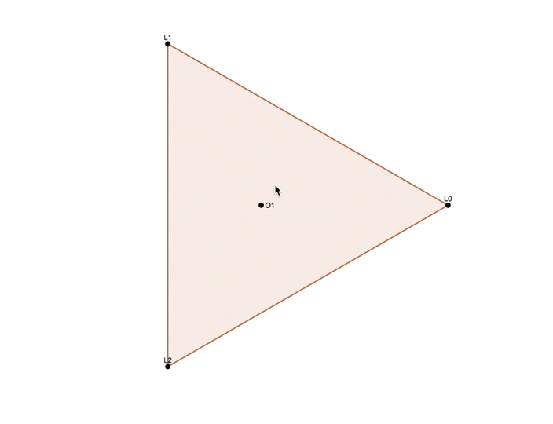

d3.geometer
===========

A utility library for d3js that allows drawing of geometric primitives, labels, connections and more.

## Documentation

See [the docs](docs/d3_geometer.html) for more.

## Examples

NGON

